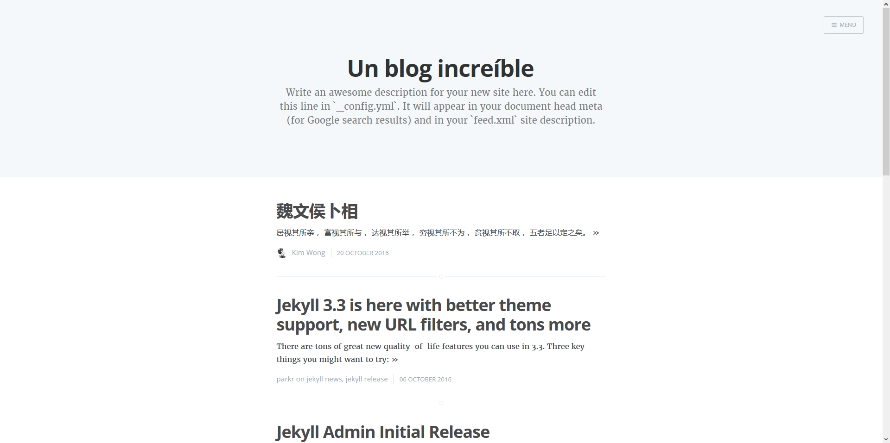
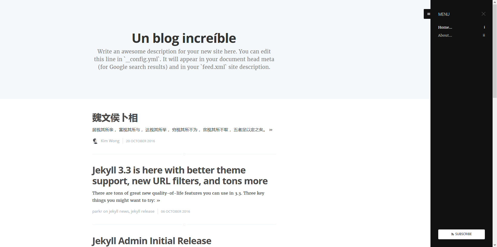

my-casper
========

My-casper is a [Casper][] alike theme, which is [Ghost's][ghost] default
theme. It's ported from [Ghost][] because the author like things to keep in
simple and beauty. Whish you like it too.

[casper]: https://github.com/TryGhost/Casper "Theme Casper at GitHub"
[ghost]:  https://ghost.org "Ghost homepage"

* Screenshot of homepage

  

* Screenshot of homepage with navigation

  

* Screenshot of post with cover

  


Installation
------------

Three steps are required to make installation.

1. Add this line to your Jekyll site's `Gemfile`:

   ```ruby
   gem "my-casper"
   ```

2. And add this line to your Jekyll site's `_config.yml`:

   ```yaml
   theme: my-casper
   ```

3. And then execute:

   ```
   $ bundle
   ```

   Or install it yourself as:

   ```
   $ gem install my-casper
   ```


Usage
-----

TODO: Write usage instructions here. Describe your available layouts,
includes, and/or sass.

* Enabling pagination

  My-capser is designed for fully pagination support. Because my-casper uses
  `jekyll-archives` to implement the tag pages, you have to install it by add
  the following lines to your Jekyll site's `Gemfile`.

  ```ruby
  gem "jekyll-paginate"
  ```

  To enable pagination, add the following line to your Jekyll site config
  file, `_config.yml`.

  ```yaml
  gems:
    - jekyll-paginate
  ```

* Enabling tag pages

  The tag pages are fully supported in my-casper. Because my-casper uses
  `jekyll-archives` to implement the tag pages, you have to install it by add
  the following lines to your Jekyll site's `Gemfile`.

  ```ruby
  gem "jekyll-archives"
  ```

  To enable the tag pages, add the following lines to your Jekyll site config
  file, `_config.yml`.

  ```yaml
  gems:
    - jekyll-archives

  jekyll-archives:
    enabled: true
  ```

* Enabling author avatar

  My-casper supports avatar in Jekyll data file stores at `_data/authors.yml`.

  ```yaml
  GitHub User:
    avatar:   /assets/avatars/icon-github.png
    slug:     github-user
    email:    someone@example.org
    location: >           # Where in the world do you live?
              88 Colin P Kelly Jr St,
              San Francisco,
              CA 94107
    website:  https://github.com  # Have a website or blog other than this one?
    github:   github      # Your GitHub account name.
    facebook: github      # Your Facebook account name.
    twitter:  github      # Your Twitter account name.
    bio:      null        # Write about you, better in 200 characters or less.
  ```

* Enabling navigations

  My-casper supports navigations in Jekyll data file stores at
  `_data/navigations.yml`.

  ```yaml
  -
    name: Home
    slug: home
    url: /
  -
    name: About
    url: /about/
  ```

* Enableing site cover

  My-casper supports cover all over the pages. You can set site cover by
  adding the line follow into your Jekyll site's `_config.yml`.

  ```yaml
  cover: /assets/covers/site-cover.jpg
  ```

* Enableing page covers

  You can set cover of a page/post by adding the line follow into your
  page/post's Front Matter.

  ```yaml
  ---
  ...
  cover: /assets/covers/site-cover.jpg
  ---
  ```

* Make your site more like Ghost's

  Add lines below to your Jekyll site's config file, `_config.yml`.

  ```yaml
  paginate: 5
  paginate_path: /page/:num/
  permalink: /:title/
  ```

<!--
* Customization

  To override the default structure and style of my-casper, simply create the
  concerned directory at the root of your site, copy the file you wish to
  customize to that directory, and then edit the file. e.g., to override the
  `_includes/head.html` file to specify a custom style path, create an
  `_includes` directory, copy `_includes/head.html` from my-casper gem folder
  to `<yoursite>/_includes` and start editing that file.

  TODO: ...
-->


Contributing
------------

Bug reports and pull requests are welcome on GitHub at
https://github.com/kimw/my-casper. This project is intended to be a safe,
welcoming space for collaboration, and contributors are expected to adhere to
the [Contributor Covenant](http://contributor-covenant.org) code of conduct.


Development
-----------

To set up your environment to develop this theme, run `bundle install`.

To test your theme, run `bundle exec jekyll serve` and open your browser at
`http://localhost:4000/blog/`. This starts a Jekyll server using your theme.
Add pages, documents, data, etc. like normal to test your theme's contents.
As you make modifications to your theme and to your content, your site will
regenerate and you should see the changes in the browser after a refresh,
just like normal.

When your theme is released, only the files in `_layouts`, `_includes`, and
`_sass` tracked with Git will be released.


TODO List
---------

 - [ ] SASS-ize the style files. P2
 - [ ] Author pages. P3
 - [ ] tag cover feature. P3
 - [ ] tag description feature. P3
 - [ ] subscribe feature. P3
 - [ ] Comments feature. P5
 - [ ] Google Analytics feature. P5
 - [ ] CJK support feature. P?
 - [ ] Can jekyll-archive support pagination? P?

`P + number` means the priority. P1 means super high, P2 means high, P3 means
normal, P4 means lower, P5 means maybe, or maybe not implement some day.
P? means not prioritized.


License
-------

The theme is available as open source under the terms of the [MIT License][].


[mit license]: http://opensource.org/licenses/MIT
